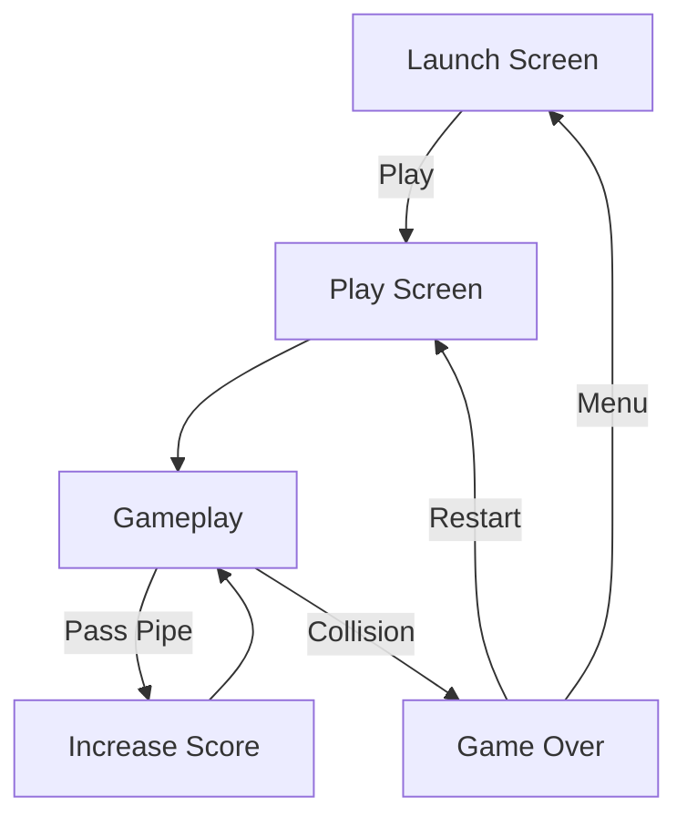

<div align="center">

# Floy Bird

### A small Flappy Bird-inspired game built with Unity and C#

My first Unity project, created to learn the fundamentals of 2D gameplay, physics, spawning, UI, animation, audio, and basic game-state management.


</div>

---

## Overview

**Floy Bird** is a simple 2D arcade game inspired by Flappy Bird.

The player controls a bird moving continuously through randomly generated pipes. The goal is to pass through as many pipes as possible without colliding with an obstacle.

The project was created as my first Unity game and focuses on learning the core building blocks of a small complete game rather than implementing a large-scale architecture.

---

## Gameplay

The gameplay loop is straightforward:

1. Start the game from the launch screen.
2. Press `Space` to make the bird flap upward.
3. Navigate through randomly positioned pipes.
4. Gain one point for every pipe successfully passed.
5. Avoid colliding with the pipes.
6. Try to beat the saved high score.
7. Restart after a game over or return to the main menu.

---

## Controls

| Action         | Control |
| -------------- | ------- |
| Flap           | `Space` |
| Pause / Resume | `P`     |

Menu and game-over actions are controlled through the on-screen UI.

---

## Features

* 2D physics-based bird movement
* Randomized pipe spawning
* Pipe movement and cleanup
* Collision-based game-over handling
* Score tracking
* Persistent high score
* Launch screen
* Game-over screen
* Restart functionality
* Return-to-menu functionality
* Pause and resume
* Wing-flap animation
* Sound effects
* Background audio
* Procedurally generated clouds
* Randomized cloud position, size, and speed

---

## High Score

The player's best score is persisted locally using Unity's `PlayerPrefs`.

When the player earns a new high score:

```csharp id="i75w7n"
PlayerPrefs.SetInt("HighScore", playerScore);
```

The saved value is then displayed on the launch screen the next time it is opened.

---

## Game Flow



---

## Core Scripts

### `BirdScript.cs`

Controls the player bird.

Responsibilities include:

* Detecting the `Space` key
* Applying upward velocity
* Detecting collisions
* Triggering game over
* Stopping the bird's wing animation after collision
* Playing collision audio

### `PipeSpawnerScript.cs`

Periodically creates new pipes at randomized vertical positions.

### `PipeScript.cs`

Moves pipes across the screen and destroys them after they leave the playable area.

### `PipeMiddleScript.cs`

Detects when the player successfully passes through a pipe and increments the score.

### `LogicManager.cs`

Handles general game flow including:

* Current score
* High-score persistence
* Restarting the game
* Game-over UI
* Pause/resume
* Returning to the menu
* Quitting the game

### `CloudGeneratorScript.cs`

Creates clouds at randomized:

* Vertical positions
* Sizes
* Movement speeds

The system also pre-populates the screen with clouds when gameplay starts.

### `CloudScript.cs`

Moves individual clouds and removes them once they leave the screen.

### `LaunchScreenScript.cs`

Loads the saved high score and displays it on the launch screen.

---

## Scenes

The game contains two scenes configured in the Unity build:

```text id="5eun5o"
Assets/Scenes/
├── Launch Screen.unity
└── Play Screen.unity
```

### Launch Screen

Contains the game title, saved high score, and controls for starting or exiting the game.

### Play Screen

Contains the main gameplay systems, player, pipe spawner, scoring, game-over UI, audio, and environmental elements.

---

## Technology

| Area            | Technology                      |
| --------------- | ------------------------------- |
| Engine          | Unity 6000.0.32f1               |
| Language        | C#                              |
| Game Type       | 2D                              |
| Rendering       | Universal Render Pipeline       |
| Physics         | Unity Physics 2D                |
| UI              | Unity UI / TextMesh Pro         |
| Animation       | Unity Animator                  |
| Persistence     | PlayerPrefs                     |
| IDE Integration | JetBrains Rider / Visual Studio |

---

## Project Structure

The Unity project is located inside the `game1` directory:

```text id="zu45hc"
Flappy-Bird-Clone/
├── game1/
│   ├── Assets/
│   │   ├── Animations/
│   │   ├── Prefabs/
│   │   ├── Scenes/
│   │   ├── Scripts/
│   │   └── Sprits/
│   │
│   ├── Packages/
│   └── ProjectSettings/
│
├── README.md
└── LICENSE
```

The main gameplay scripts are located in:

```text id="4dp7yh"
game1/Assets/Scripts/
```

---

## Getting Started

### Requirements

* Unity Hub
* **Unity 6000.0.32f1**
* Git

Using the same Unity version is recommended to avoid unnecessary project upgrades.

### 1. Clone the Repository

```bash id="cngn27"
git clone https://github.com/memezsxz/Flappy-Bird-Clone.git
cd Flappy-Bird-Clone
```

### 2. Add the Project to Unity Hub

Open **Unity Hub** and select:

**Add → Add project from disk**

Select:

```text id="j3jy41"
Flappy-Bird-Clone/game1
```

### 3. Open the Project

Open the project using:

```text id="sj7xf2"
Unity 6000.0.32f1
```

Allow Unity Package Manager to restore the project's dependencies.

### 4. Open the Launch Scene

Open:

```text id="6934ko"
Assets/Scenes/Launch Screen.unity
```

### 5. Run

Press the Unity Editor's **Play** button.

Start the game from the launch screen and use `Space` to control the bird.

---

## What I Learned

This project was my introduction to building a complete game in Unity and helped me practice:

* Unity's component-based workflow
* C# scripting with `MonoBehaviour`
* `Rigidbody2D` physics
* Colliders and trigger events
* Object instantiation
* Randomized procedural spawning
* Scene management
* UI interaction
* Animation
* Audio
* Local persistence with `PlayerPrefs`
* Basic game-state handling

---

## Project Status

Floy Bird is a **completed learning project** and my first Unity game.

It is preserved as a small portfolio project showing the foundations I built before working on larger Unity and Unreal gameplay systems.

---

## License

This project is licensed under the [GNU General Public License v3.0](LICENSE).
